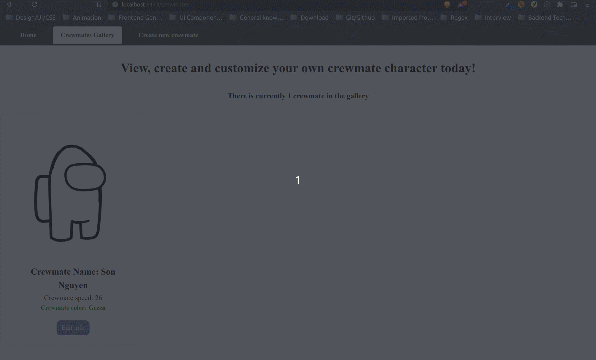

# Web Development Project 7 - _Crewmates_

Submitted by: **Hudson Nguyen**

This web app: **Do you currently have a game that you absolutely love? Have you ever wanted to customize the characters or build your own team in the game? Now you can make your own team of players in any game of your choosing with this week's project! You will plan, design, and build a custom web app that allows the user to assemble a specific type of team. You can choose their own theme for the app and are encouraged to rename it based on that theme.**

Time spent: crewmate-info-btn**3** hours spent in total

## Required Features

The following **required** functionality is completed:

- [x] **A create form allows users to add new cremates**
- [x] **Users can name the crewmate and set the crewmate's attributes by clicking on one of several values**
- [x] **The site displays a summary page of all the user's added crewmates**
- [x] **A previously created crewmate can be updated and deleted from the crewmate list**
- [x] **Each crewmate has a direct, unique link to an info page about them**

The following **optional** features are implemented:

- [x] A crewmate can be given a category upon creation which restricts their attributes
- [x] The site displays summary statistics about a user's crew on their crew page
- [x] The site displays a custom "success" metric about a user's crew which changes the look of the crewmate list

The following **additional** features are implemented:

- [x] Optimize web performance!

## Video Walkthrough

Here's a walkthrough of implemented user stories:

GIF created with [peek](https://github.com/phw/peek) for Linux.

## Notes

Describe any challenges encountered while building the app.

## License

    Copyright [2023] [Hudson Nguyen]

    Licensed under the Apache License, Version 2.0 (the "License");
    you may not use this file except in compliance with the License.
    You may obtain a copy of the License at

        http://www.apache.org/licenses/LICENSE-2.0

    Unless required by applicable law or agreed to in writing, software
    distributed under the License is distributed on an "AS IS" BASIS,
    WITHOUT WARRANTIES OR CONDITIONS OF ANY KIND, either express or implied.
    See the License for the specific language governing permissions and
    limitations under the License.
